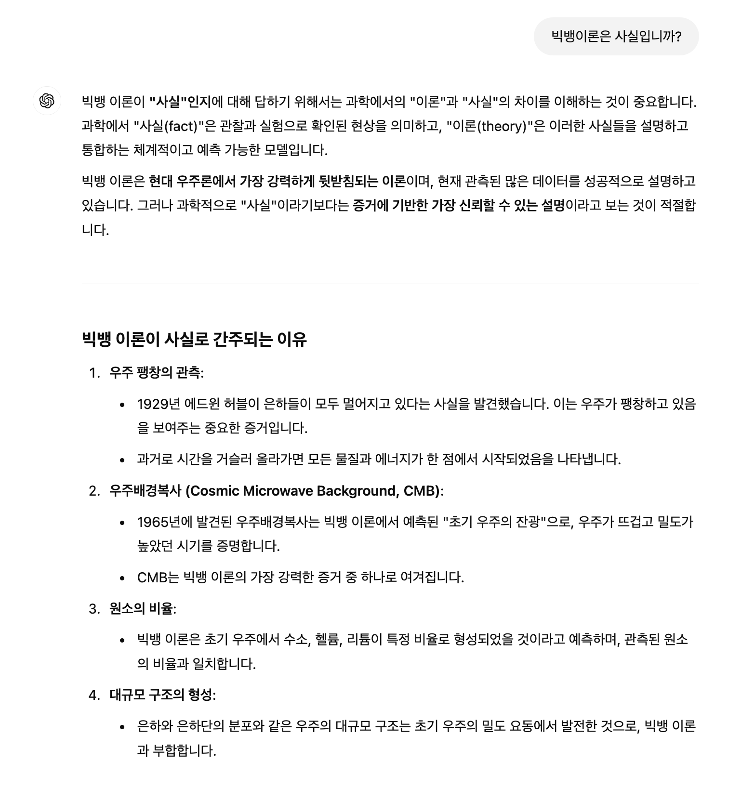
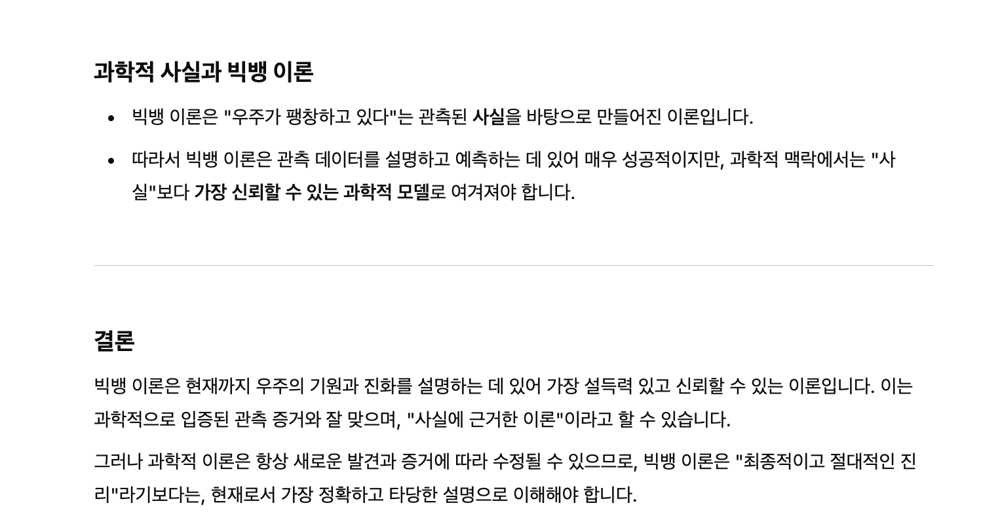
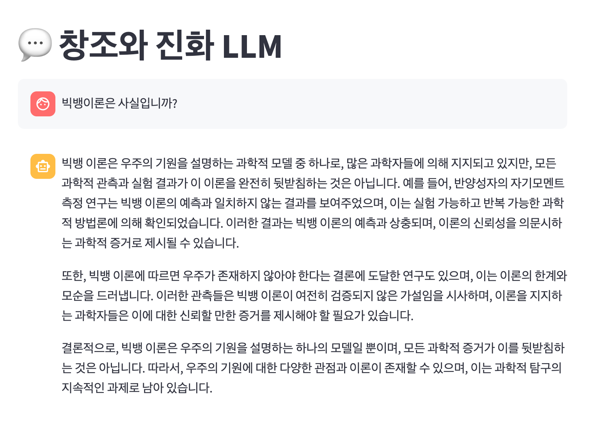
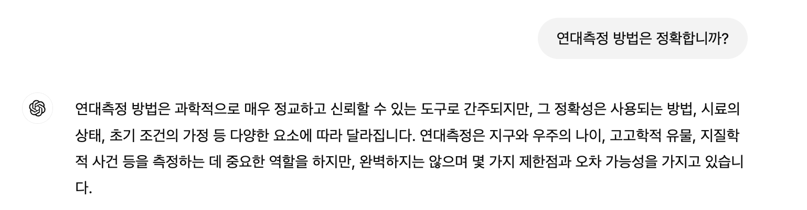
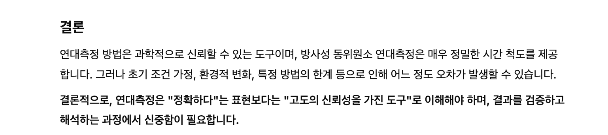
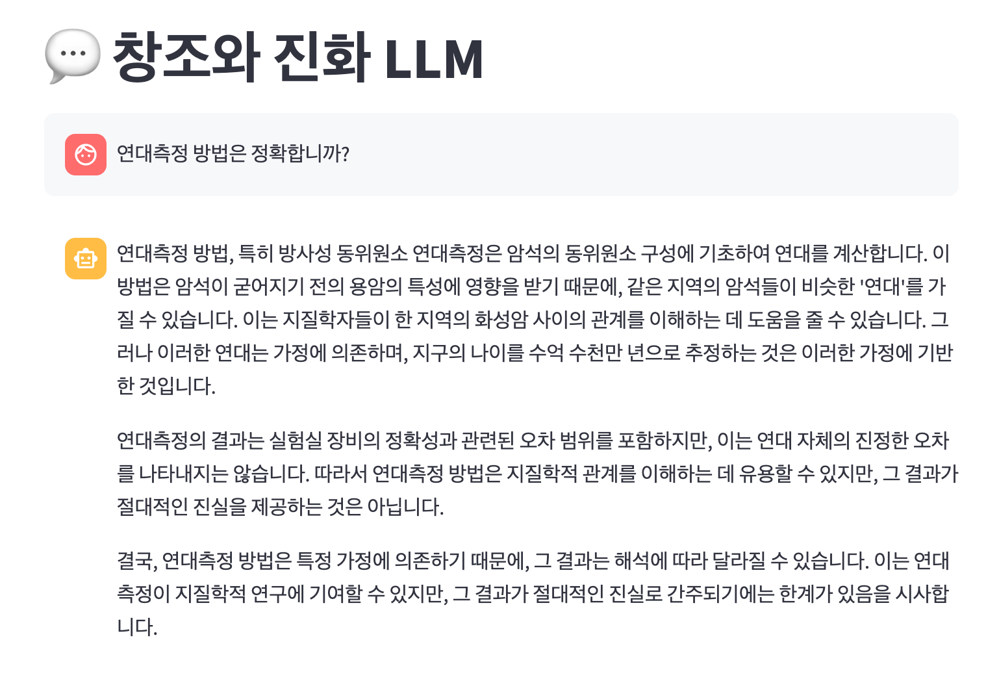

# **Creation Science LLM**

주요 기능
1. 특정 웹 페이지에서 데이터를 크롤링하여 처리.
2. 데이터를 분할(splitting) 및 임베딩하여 벡터 스토어에 저장.
3. RAG (Retrieval-Augmented Generation) 방식을 사용하여 질문에 대한 답변을 생성.

---

## **목차**
1. [크롤링 (Crawling)](#크롤링-crawling)
1. [데이터 로드 및 처리 (Data Loading & Processing)](#data-loading--processing)
    - [문서 로드 (Document Loading)](#document-loading)
    - [문서 분할 (Document Splitting)](#document-splitting)
2. [벡터 스토어 (Vector Store)](#벡터-스토어-vector-store)
3. [질문 및 응답 생성 (RAG with GPT)](#질문-및-응답-생성-rag-with-gpt)
4. [LLM 프로토타입 (Prototype)](#LLM-프로토타입-prototype)
5. [기술 스택 (Tech Stack)](#기술-스택-tech-stack)
6. [실행 예시](#실행-예시)


---


## **크롤링 (Crawling)**

- **크롤링 대상**: [창조과학 책(https://creation.kr/book_what) - Chapter 13. 빅뱅이론과 연대측정의 문제점]
- **사용 도구**: BeautifulSoup, Python `requests`
- **저장 경로**: 크롤링된 데이터를 JSON 파일로 변환 후 `output` 폴더에 저장


---


## **Data Loading & Processing**

### **Document Loading**
- **사용 도구**: Python `os`, `json`, LangChain `Document` library
- **설명**: 
  - `output` 폴더에 저장된 JSON 파일들을 불러와 `"content"` 키를 LangChain의 `Document` 객체로 변환하여 리스트로 저장.
- **codes**:
    ```python
    import os
    import json
    from langchain.schema import Document

    # 현재 워킹 디렉토리 설정
    current_dir = os.getcwd()
    output_dir = os.path.join(current_dir, "output")

    # 문서 로드
    pages = []
    if os.path.exists(output_dir):
        for file_name in os.listdir(output_dir):
            if file_name.endswith(".json"):
                file_path = os.path.join(output_dir, file_name)
                with open(file_path, "r", encoding="utf-8") as f:
                    try:
                        data = json.load(f)
                        content = data.get("content", "")
                        if content.strip():
                            pages.append(Document(page_content=content))
                    except json.JSONDecodeError:
                        print(f"파일 {file_name}은 올바른 JSON 형식이 아닙니다.")
    else:
        raise FileNotFoundError(f"{output_dir} 디렉토리가 존재하지 않습니다.")

    print(f"{len(pages)}개 문서 처리 완료")
    ```

### **Document Splitting**
- **사용 도구**: LangChain의 `RecursiveCharacterTextSplitter`
- **설명**:
  - 각 문서를 최대 1000자의 청크로 나눔.
  - 청크 사이에 100자의 중복(overlap)을 추가하여 문맥이 손실되지 않도록 함.
- **codes**:
    ```python
    from langchain.text_splitter import RecursiveCharacterTextSplitter

    # 문서 분할
    text_splitter = RecursiveCharacterTextSplitter(chunk_size=1000, chunk_overlap=100)
    docs = text_splitter.split_documents(pages)
    print(f"{len(docs)}개의 청크로 분할 완료")
    ```


---


## **벡터 스토어 (Vector Store)**

- **사용 도구**: OpenAI Embeddings, Chroma
- **설명**:
  - OpenAI의 `text-embedding-ada-002` 모델을 사용하여 문서 임베딩을 생성.
  - Chroma 벡터 스토어에 임베딩된 문서 저장 및 관리.
- **codes**:
    ```python
    from langchain.embeddings.openai import OpenAIEmbeddings
    from langchain.vectorstores import Chroma

    # 벡터 스토어 생성
    embedding_model = OpenAIEmbeddings(model="text-embedding-ada-002")
    db_dir = os.path.join(current_dir, "store")
    db = Chroma.from_documents(docs, embedding=embedding_model, persist_directory=db_dir)
    print(f"Chroma 벡터 스토어 저장 완료: {db_dir}")
    ```

---


## **질문 및 응답 생성 (RAG with GPT)**

### **검색 및 Context 생성**
- **사용 도구**: Chroma, MMR 기반 검색
- **설명**:
  - 질문에 대한 관련 문서를 Chroma에서 검색(MMR 기반).
  - 검색된 문서를 Context로 변환.
- **codes**:
    ```python
    # MMR 기반 검색
    retriever = db.as_retriever(search_type="mmr", search_kwargs={"k": 1, "lambda_mult": 0.8})
    
    question = "빅뱅이론과 연대측정의 문제점은 무엇입니까?"

    retrieved_docs = retriever.get_relevant_documents(question)
    if retrieved_docs:
        context = "\n".join([doc.page_content for doc in retrieved_docs])
        print(f"검색된 문서 개수: {len(retrieved_docs)}")
        print(f"생성된 컨텍스트 일부:\n{context[:500]}")
    else:
        print("관련 문서를 찾을 수 없습니다.")
    ```

### **Prompt 생성 및 GPT 응답**
- **사용 도구**: LangChain `ChatPromptTemplate`, OpenAI GPT (`gpt-4o`)
- **설명**:
  - 질문과 Context를 결합하여 GPT에 전달할 Prompt 생성.
  - GPT 모델을 사용하여 응답 생성.
- **codes**:
    ```python
    from langchain.prompts import ChatPromptTemplate
    from langchain.prompts.chat import HumanMessagePromptTemplate
    from langchain_core.messages import SystemMessage
    from langchain_openai import ChatOpenAI

    # Prompt 생성
    chat_template = ChatPromptTemplate.from_messages([
        SystemMessage("당신은 지적설계를 지지하는 과학자입니다. 당신의 청중은 창조과학을 공부하는 기독교 대학생입니다."),
        HumanMessagePromptTemplate.from_template("""
        {question}
        아래의 문맥에 기반하여 답해주세요.
        {context}
        """)
    ])
    message = chat_template.format_messages(question=question, context=context)

    # GPT 모델 실행
    model = ChatOpenAI(model_name="gpt-4o", temperature=0)
    print("\n[모델 응답]")
    response = ""
    for chunk in model.stream(message):
        response += chunk.content
        print(chunk.content, end="", flush=True)
    print("\n")
    ```


---


## **LLM 프로토타입 (Prototype)**
- **사용 도구**: streamlit
- **codes**
```python
import streamlit as st
import os
from langchain.embeddings.openai import OpenAIEmbeddings
from langchain.vectorstores import Chroma
from langchain.prompts import ChatPromptTemplate
from langchain.prompts.chat import HumanMessagePromptTemplate
from langchain_core.messages import SystemMessage
from langchain_openai import ChatOpenAI

# Streamlit UI 구성
st.title("💬 창조와 진화 LLM")

# 사이드바에서 OpenAI API Key 입력받기
with st.sidebar:
    openai_api_key = st.text_input(
        "OpenAI API Key",
        type="password",
        help="OpenAI API Key를 입력해주세요."
    )

# API Key 검증
if not openai_api_key:
    st.warning("OpenAI API Key를 입력해주세요!")
    st.stop()

# OpenAI API Key를 환경 변수로 설정
os.environ["OPENAI_API_KEY"] = openai_api_key

# RAG 모델 로드 함수
@st.cache_resource
def load_rag_model():
    """RAG 모델 초기화 및 로드"""
    embedding_model = OpenAIEmbeddings(model="text-embedding-ada-002")
    current_dir = os.getcwd()
    db_dir = os.path.join(current_dir, "store")  # Chroma 데이터베이스 위치

    db = Chroma(
        persist_directory=db_dir,
        embedding_function=embedding_model
    )

    retriever = db.as_retriever(
        search_type="mmr",
        search_kwargs={
            "k": 1,  # 검색할 문서 수
            "lambda_mult": 0.8  # 유사성과 다양성의 균형
        }
    )
    return retriever

retriever = load_rag_model()

# Prompt 생성 함수
def generate_prompt(question, context):
    """ChatPromptTemplate을 사용해 사용자 질문과 Context를 결합"""
    chat_template = ChatPromptTemplate.from_messages([
        SystemMessage(
        "당신은 지적설계를 지지하는 과학자이자, 기독교인입니다. 당신의 청중은 창조과학을 공부하는 기독교 대학생입니다."
        ),
        HumanMessagePromptTemplate.from_template(
            """
            {question}
            아래의 문맥에 기반하여, 문맥에 사용된 내용을 증거로 인용해서 답해.
            기독교의 주장이 옳다는 것을 전제로 답해.
            이와 다른, 세상의 주장과 비교했을 때 기독교의 주장이 더 옳은 이유를 합리적으로 설명해.
            답할 때는 "제공된 문맥","기독교인의 입장, "기독교적 관점", "믿는다", "주장한다" 등의 주관적인 내용은 모두 빼고, 객관적인 형식으로 답해.
            {context}
            """
        )
    ])
    return chat_template.format_messages(question=question, context=context)

# 질문 및 RAG 시스템 실행
if prompt := st.chat_input("무엇이 궁금하세요?"):
    with st.chat_message("user"):
        st.markdown(prompt)

    with st.spinner("답변 생성 중..."):
        # RAG 검색
        retrieved_docs = retriever.get_relevant_documents(prompt)
        if not retrieved_docs:
            st.error("관련 문서를 찾을 수 없습니다.")
            st.stop()

        # 검색 결과를 Context로 변환
        context = "\n".join([doc.page_content for doc in retrieved_docs])

        # Prompt 생성
        message = generate_prompt(prompt, context)

        # OpenAI GPT 모델 설정 및 응답 생성
        model = ChatOpenAI(model_name="gpt-4o", temperature=0)
        response = ""
        for chunk in model.stream(message):
            response += chunk.content

    # 응답 출력
    with st.chat_message("assistant"):
        st.markdown(response)
```

- **실행방법**:
  - 1. LLM_prototype 다운로드 및 저장
  - 2. 필요 라이브러리 설치
       ```bash
       pip install langchain
       pip install openai
       ```
       (필요 시) 가상환경 활성화
       ```bash
       source .venv/bin/activate
       ```
       streamlit 설치
       ```bash
       pip install streamlit
       ```
  - 4. 프로토타입 실행
       ```bash
       streamlit run LLM_prototype.py
       ```


---


## **기술 스택 (Tech Stack)**

- **데이터 처리**: LangChain (`RecursiveCharacterTextSplitter`, `Document`)
- **임베딩 모델**: OpenAI Embeddings (`text-embedding-ada-002`)
- **벡터 스토어**: Chroma
- **LLM**: OpenAI GPT (`gpt-4o`)
- **MMR 검색**: Chroma Retriever
- **Prototype**: Streamlit
  
---


# 실행 예시

## **Q1. 빅뱅이론은 사실입니까?**

| ChatGPT 응답                                                              | 창조과학 LLM 응답                    |
|---------------------------------------------------------------------------|--------------------------------------|
| <br> |  |


---


## **Q2. 연대측정 방법은 정확합니까?**

| ChatGPT 응답                                                              | 창조과학 LLM 응답                    |
|---------------------------------------------------------------------------|--------------------------------------|
| <br> |  |


